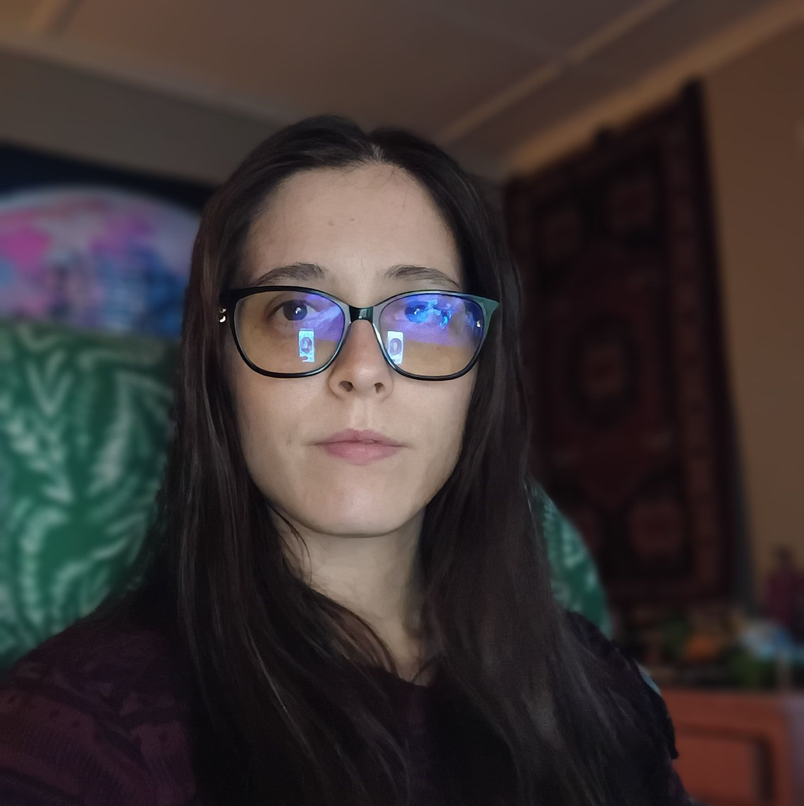

# 📸 How to Add Your Profile Photo to BarodaTek.com

## Quick Method (Recommended):

### Option 1: Save the image you sent
1. Right-click on the image you sent
2. Save it as: `jbaroda-profile.jpg`
3. Copy it to: `c:\NewpROJEKTAI\public\`

### Option 2: Upload to Imgur (Free hosting)
1. Go to: https://imgur.com/upload
2. Upload your photo
3. Right-click the uploaded image → "Copy image address"
4. You'll get a URL like: `https://i.imgur.com/XXXXXX.jpg`

## Then Update These Files:

### Update about.html:
Find this line (around line 340):
```html

```

Replace with:
```html
<!-- Option 1: Local file -->


<!-- OR Option 2: Imgur URL -->

```

### That's it! Your photo will appear on:
- ✅ About page (about.html)
- ✅ Main site About section (if photo is shown there)

## Pro Tip:
The image will be automatically styled to:
- Round shape (profile-image class)
- Proper sizing
- Professional appearance

---
*Your photo makes the site even more personal and professional!* 🌟