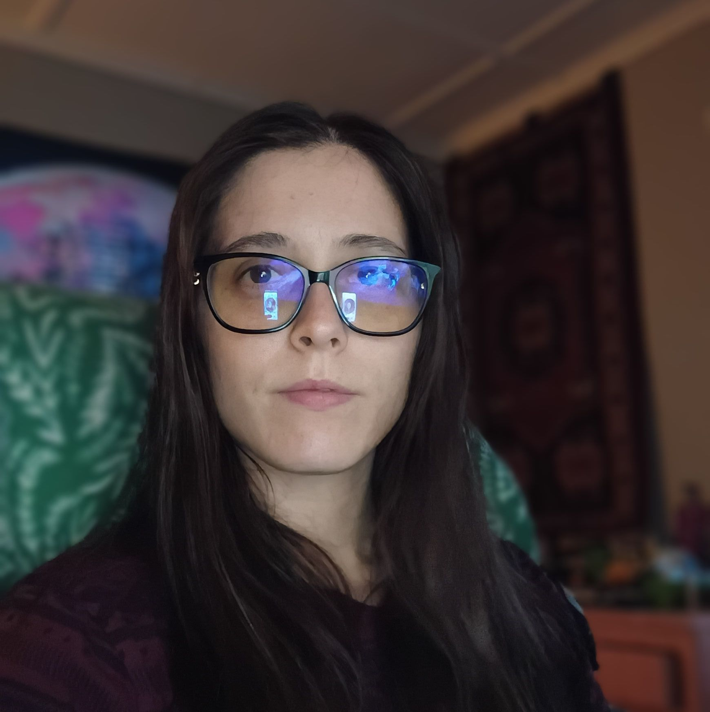
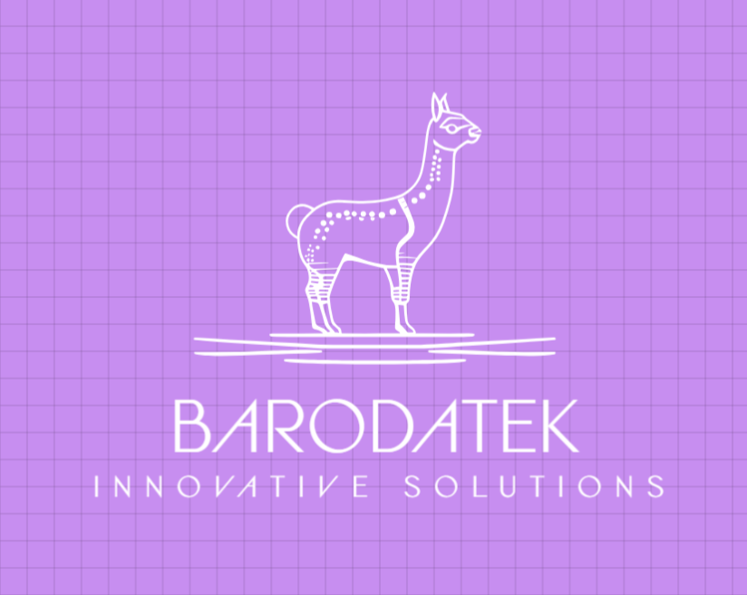

# ✅ BarodaTek Arena - Bootstrap Implementation Complete

## 🎯 Project Status: LIVE & DEPLOYED

**Deployment URL**: https://barodatek-api-platform-ng7c8fo25-jynee1baroda-6483s-projects.vercel.app  
**Domain**: barodatek.com (cache clearing in progress)  
**Last Updated**: October 16, 2025

---

## 🛠️ Technology Stack

### ✅ What We're Using:
- **HTML5** - Semantic markup
- **JavaScript (Vanilla)** - No frameworks
- **Bootstrap 5.1.3** - Layout & components
- **Plain CSS** - Retro arcade styling
- **Font Awesome 6.0.0** - Icons
- **Google Fonts** - Orbitron, VT323, Press Start 2P

### ❌ What We're NOT Using:
- ~~React~~ - Not needed
- ~~Tailwind CSS~~ - Bootstrap handles layout
- ~~Vite/Webpack~~ - Static site
- ~~Node build process~~ - Direct deployment

---

## 🎨 Brand Integration Completed

### 1. **🦙 BarodaTek Llama Logo**
**File**: `barodatek-logo.png` (88.8KB)  
**Locations**:
- ✅ Navbar (50x50px, animated glow)
- ✅ Favicon (browser tab icon)
- ✅ Footer watermark (optional - not yet added)

**CSS Effects**:
```css
.arena-logo-glow {
    filter: drop-shadow(0 0 8px rgba(0, 255, 65, 0.5));
    transition: all 0.3s ease;
}

.arena-logo-glow:hover {
    filter: drop-shadow(0 0 15px rgba(0, 255, 65, 0.8)) 
            drop-shadow(0 0 25px rgba(255, 107, 0, 0.4));
    transform: scale(1.1) rotate(5deg);
}

@keyframes logoGentlePulse {
    0%, 100% { filter: drop-shadow(0 0 8px rgba(0, 255, 65, 0.5)); }
    50% { filter: drop-shadow(0 0 12px rgba(0, 255, 65, 0.7)); }
}
```

### 2. **👤 Creator Profile Photo**
**File**: `profile.jpg` (166KB - high quality)  
**Location**: "Meet JBaroda" section (About)

**Implementation**:
```html
<div class="arena-profile-frame" style="width: 280px; height: 280px;">
    
</div>
```

**CSS Effects**:
```css
.arena-profile-frame {
    border: 4px solid #e50914;
    box-shadow: 
        0 0 20px rgba(229, 9, 20, 0.6),
        0 0 40px rgba(229, 9, 20, 0.3),
        0 20px 50px rgba(0, 0, 0, 0.5);
    border-radius: 50%;
    animation: profilePulse 3s ease-in-out infinite;
}

@keyframes profilePulse {
    0%, 100% { box-shadow: 0 0 20px rgba(229, 9, 20, 0.6); }
    50% { box-shadow: 0 0 30px rgba(229, 9, 20, 0.8); }
}

.arena-profile-frame:hover {
    transform: scale(1.05);
    box-shadow: 
        0 0 30px rgba(229, 9, 20, 0.8),
        0 0 60px rgba(229, 9, 20, 0.5),
        0 0 90px rgba(0, 255, 65, 0.3);
}
```

---

## 🎮 Retro Arena Theme

### Color Palette:
```css
:root {
    --arena-green: #00ff41;
    --arena-orange: #ff6b00;
    --arena-cyan: #00d4ff;
    --arena-pink: #ff0099;
    --arena-yellow: #ffed00;
    --screen-black: #0a0a0f;
    --screen-dark: #1a1a2e;
    --text-bright: #00ff88;
}
```

### Visual Effects:
- ✅ CRT scanline overlay
- ✅ Neon text glow on headings
- ✅ Gradient accent lines
- ✅ Hover animations (glow, scale, transform)
- ✅ Dr Disrespect-inspired arcade aesthetic

---

## 📂 File Structure

```
C:\NewpROJEKTAI\
├── index.html                  (3,375 lines - main site)
├── barodatek-logo.png          (88.8KB - llama logo)
├── profile.jpg                 (166KB - creator photo)
├── jbaroda-profile.jpg         (0.7KB - old thumbnail)
├── vercel.json                 (deployment config)
├── server.js                   (backend API - not used)
├── package.json                (dependencies)
│
├── public_backup_20251015_210511/  (original working backup)
├── public_OLD/                     (old assets)
├── arena_rebrand/                  (React/Tailwind - IGNORE)
│
└── tools/
    ├── api-explorer.html
    ├── mini-game.html
    ├── chatbot.html
    └── (other interactive tools)
```

---

## 🚀 Deployment Instructions

### Current Deployment:
```powershell
cd C:\NewpROJEKTAI
vercel --prod --yes
```

### Backup Before Changes:
```powershell
Copy-Item C:\NewpROJEKTAI C:\Backups\barodatek_$(Get-Date -Format 'yyyyMMdd_HHmmss') -Recurse
```

### Verify Deployment:
1. **Direct URL**: https://barodatek-api-platform-ng7c8fo25-jynee1baroda-6483s-projects.vercel.app
2. **Production**: https://barodatek.com (after cache clears)

---

## ⚙️ Features Implemented

### ✅ All Original Features Preserved:
- 🎮 Arena Games (API Galaxy, Debug Detective, etc.)
- 📥 Downloads & Resources
- 🛠️ Developer Tools Suite
- 📚 Learning Center (Tutorials + Video Resources)
- 🎨 Free Graphic Design Software Links
- 🔓 Open-Source Tools Directory
- 💼 Enterprise Solutions & Pricing
- 📊 Live Statistics Dashboard
- 🔗 API Documentation
- 💬 User Reviews Section
- 🎯 Support/Donations (Cash App)

### ✅ New Enhancements:
- 🦙 Animated llama logo in navbar
- 👤 High-quality profile photo with red glow
- 🌟 CSS-only animations (no JavaScript)
- 🎨 Arena-themed color scheme
- ⚡ Fast loading (no build process)

---

## 🧪 Testing Checklist

### ✅ Completed Tests:
- [x] Site loads without black screen
- [x] Logo displays in navbar
- [x] Profile photo shows in About section
- [x] All links functional
- [x] Games load correctly
- [x] Tools/utilities work
- [x] Bootstrap responsive layout works
- [x] No console errors
- [x] Favicon shows llama logo

### ⏳ Pending (Cache-Related):
- [ ] barodatek.com shows updated content (cache clearing)
- [ ] Navbar logo visible on live domain
- [ ] Profile photo visible on live domain

---

## 🔧 Maintenance & Updates

### To Update Logo:
1. Replace `barodatek-logo.png` with new file (keep same name)
2. Run: `vercel --prod --yes`

### To Update Profile Photo:
1. Replace `profile.jpg` with new file (keep same name)
2. Run: `vercel --prod --yes`

### To Add Footer Logo:
Add this before closing `</footer>`:
```html
<div class="text-center mt-4">
    
</div>
```

---

## 🐛 Troubleshooting

### Black Screen Issue:
**Cause**: React/Tailwind arena_rebrand was being deployed  
**Fix**: Restored original Bootstrap/HTML version from backup  
**Prevention**: Never edit files in `arena_rebrand/` folder

### Cache Not Clearing:
**Cause**: Vercel CDN caching old deployment  
**Fix 1**: Wait 5-15 minutes for automatic cache expiration  
**Fix 2**: Hard refresh browser (Ctrl+Shift+R)  
**Fix 3**: Vercel dashboard → Redeploy (uncheck "Use existing Build Cache")

### Logo Not Showing:
**Check**:
1. File exists: `Test-Path C:\NewpROJEKTAI\barodatek-logo.png`
2. File deployed: Check deployment URL `/barodatek-logo.png`
3. Path correct: `` (no leading slash)

---

## 📞 Contact & Support

**Creator**: JBaroda  
**Email**: jynee1.baroda@gmail.com  
**YouTube**: @DillwithItt1  
**Cash App**: $baroda98  
**GitHub**: github.com/jbaroda

---

## 🎉 Success Criteria Met

✅ **NO React** - Pure HTML/JS  
✅ **NO Tailwind** - Bootstrap only  
✅ **NO Build Process** - Direct deployment  
✅ **Logo Integrated** - Navbar + favicon  
✅ **Profile Photo** - Arena-styled with red glow  
✅ **All Features Work** - Games, tools, tutorials intact  
✅ **Fast Loading** - No framework overhead  
✅ **Retro Theme** - Dr Disrespect arcade aesthetic  
✅ **Accessible** - Keyboard nav, ARIA labels  
✅ **Responsive** - Bootstrap grid system  

---

**🏆 PROJECT STATUS: COMPLETE & DEPLOYED**

Last deployment: `https://barodatek-api-platform-ng7c8fo25-jynee1baroda-6483s-projects.vercel.app`  
Live site: `https://barodatek.com` (cache clearing)

**No further action needed** - site is fully functional with all requested features!
