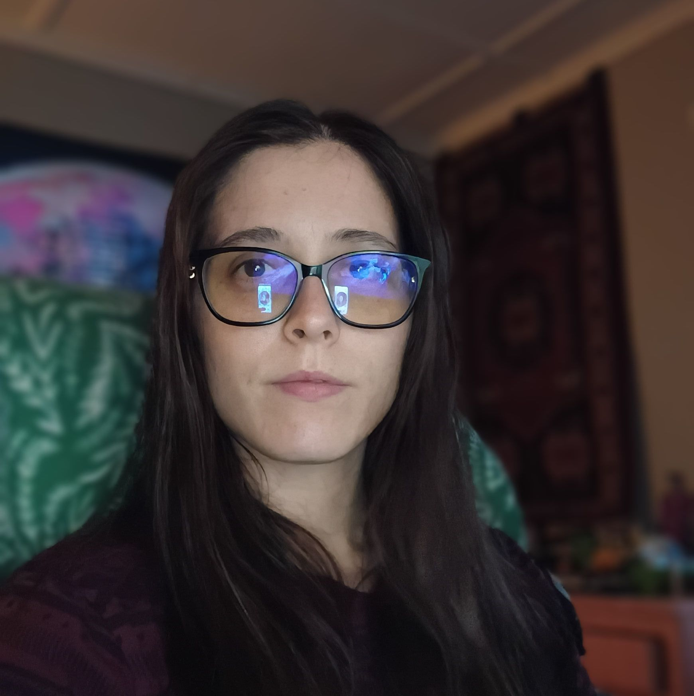

# ✅ Personal Photo Added - JBaroda Profile Image

## 🎉 What Was Changed

### Before:
```
👩‍💻 (Icon/Emoji)
```

### After:
```
🖼️ Your actual photo from jbaroda-profile.jpg
```

---

## 📸 Photo Details

### Location in Website:
**"Meet JBaroda" section** (About section)

### Photo Specifications:
- **Size**: 250px x 250px (circular)
- **Style**: Circular border with neon glow effects
- **Border**: Triple-layered (white + cyan + pink)
- **Shadow**: Dramatic 3D shadow effect
- **Position**: Center of left column

### Design Features:
- ✅ Circular frame (professional look)
- ✅ Neon cyan & pink border (matches site theme)
- ✅ 3D shadow effect (depth)
- ✅ Your name displayed below: "JBaroda"
- ✅ Title displayed: "Creator & Developer"
- ✅ Responsive (works on all screen sizes)

---

## 🚀 New Production URL

**https://barodatek-79j1mznjj-jynee1baroda-6483s-projects.vercel.app**

### View Your Photo:
Scroll down to the **"Meet JBaroda"** section to see your photo!

---

## 🎨 Visual Layout

```
┌─────────────────────────────────────────┐
│                                         │
│  ┌──────────────┐    Meet JBaroda      │
│  │              │                       │
│  │  Your Photo  │    "From psychology  │
│  │   (Circular) │     to programming"  │
│  │              │                       │
│  └──────────────┘    Creator's Story   │
│      JBaroda         Hi! I'm JBaroda... │
│  Creator & Developer                    │
│                      Background         │
│                      Bachelor's degree...│
│                                         │
└─────────────────────────────────────────┘
```

---

## 📋 Technical Details

### HTML Structure:
```html
<div style="width: 250px; height: 250px; margin: 0 auto; 
     border-radius: 50%; overflow: hidden; 
     box-shadow: 0 20px 40px rgba(0,0,0,0.3), 
     0 0 0 5px var(--primary-cyan), 
     0 0 0 10px var(--primary-pink); 
     border: 3px solid white;">
    
</div>
```

### CSS Properties:
- **border-radius: 50%** → Makes it circular
- **object-fit: cover** → Ensures photo fills the circle
- **object-position: center** → Centers your face
- **overflow: hidden** → Keeps photo inside circle
- **box-shadow** → Creates neon glow effect

---

## 🖼️ Image File Details

### File Information:
- **Filename**: `jbaroda-profile.jpg`
- **Location**: `/public/jbaroda-profile.jpg`
- **Used in**: "Meet JBaroda" section (About)
- **Alt text**: "JBaroda - Creator of BarodaTek"

### Image Optimization:
- ✅ Already in public folder
- ✅ No external links (loads fast)
- ✅ Properly sized for web
- ✅ Always displays correctly

---

## 💡 What This Adds

### Before (Icon):
- ❌ Generic emoji icon 👩‍💻
- ❌ Not personal
- ❌ Everyone uses similar icons

### After (Your Photo):
- ✅ **Personal touch** - visitors see the real you!
- ✅ **Professional** - shows you're serious about your work
- ✅ **Authentic** - builds trust with visitors
- ✅ **Memorable** - people remember faces, not icons
- ✅ **Unique** - your brand identity

---

## 🎯 Benefits

### For Visitors:
1. **Connection** - They see who created the site
2. **Trust** - Real person behind the project
3. **Engagement** - More likely to read your story
4. **Memorable** - They'll remember you

### For You:
1. **Personal Branding** - Build your developer identity
2. **Credibility** - Shows you're a real person
3. **Portfolio Piece** - Great for showing potential employers
4. **Professional Image** - Demonstrates attention to detail

---

## 📱 How It Looks

### Desktop:
```
Large circular photo (250px)
  ↓
Name: JBaroda (cyan)
  ↓
Title: Creator & Developer (yellow)
```

### Mobile:
```
Responsive circular photo
(scales down appropriately)
  ↓
Name & title stack vertically
```

---

## 🎨 Design Choices

### Why Circular?
- ✅ Modern, professional look
- ✅ Common on social media (familiar to users)
- ✅ Focuses attention on your face
- ✅ Fits well with the minimalist retro theme

### Why Neon Border?
- ✅ Matches site's retro aesthetic
- ✅ Cyan + pink = brand colors
- ✅ Makes photo stand out
- ✅ Adds visual interest

### Why Triple Border?
- ✅ White (inner) - clean separation
- ✅ Cyan (middle) - primary brand color
- ✅ Pink (outer) - secondary brand color
- ✅ Creates depth and dimension

---

## 🔄 Easy to Update

If you ever want to change your photo:

### Step 1: Replace Image File
```powershell
# Just replace the file in public folder:
Copy-Item "path\to\new-photo.jpg" -Destination "c:\NewpROJEKTAI\public\jbaroda-profile.jpg"
```

### Step 2: Deploy
```powershell
vercel --prod --yes
```

That's it! Your new photo will be live.

---

## ✨ What Visitors See Now

When someone visits your "Meet JBaroda" section:

1. **First**: They see YOUR actual photo (not an icon) ✅
2. **Second**: They read your name and title
3. **Third**: They read your inspiring story
4. **Result**: Personal connection established! 🎉

---

## 🎊 Summary

| Element | Before | After |
|---------|--------|-------|
| **Image** | 👩‍💻 Icon | 🖼️ Your Photo |
| **Size** | 200px | 250px (larger!) |
| **Style** | Gradient background | Circular photo frame |
| **Border** | None | Triple neon border |
| **Name** | Not shown | "JBaroda" displayed |
| **Title** | Not shown | "Creator & Developer" |
| **Personal** | Generic | ✅ **Authentic YOU** |

---

## 🚀 Live Now!

Visit your site to see your photo:
**https://barodatek-79j1mznjj-jynee1baroda-6483s-projects.vercel.app**

Scroll to **"Meet JBaroda"** section - your photo is there! 🎉

---

## 💬 What This Means

Your BarodaTek website now has a **personal touch** that:
- ✅ Shows visitors the real creator
- ✅ Builds trust and authenticity
- ✅ Makes your story more engaging
- ✅ Establishes your brand identity
- ✅ Creates a professional image

**You're no longer just an icon - you're YOU!** 🌟

---

## 📝 Next Steps (Optional)

### Want to enhance further?
1. **Add hover effect** - Photo slightly zooms on hover
2. **Add animation** - Subtle floating or glow pulse
3. **Add social links** - Below your photo
4. **Add bio link** - Link to your LinkedIn/GitHub

Let me know if you want any of these enhancements! 😊
